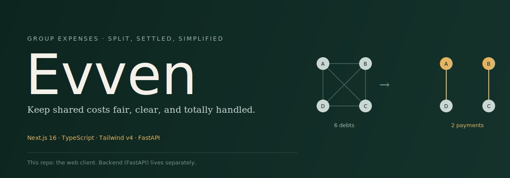

<p align="center">
  
</p>

<p align="center">
  
  
  
  
  
</p>

Evven is a group expense-splitting web app. People track shared costs inside groups, split bills equally / exactly / by percentage, settle up with friends, and keep tabs on one-off debts with people who aren't on the platform yet.

This repository is the **frontend** — a Next.js (App Router) client that talks to a separate FastAPI backend over REST. The backend lives in its own repo and isn't included here.

## Why Evven exists

Splitting costs in a group chat works until someone has to remember who owes whom. Evven's backend runs a **debt-simplification engine**: it takes every raw IOU generated by a group's expenses and collapses them into the smallest possible set of payments needed to settle everyone up — six tangled debts become two clean transfers, as shown above. The frontend surfaces that at every level: a per-group breakdown showing raw debts, aggregated debts, the simplified graph, and what's already settled (`types/groups.ts` → `GroupDebtBreakdown`).

The other piece that sets Evven apart is **ghost users** — placeholder people you can owe or be owed by even if they never sign up. A ghost gets its own shadow group, balance, and expense history, and can be reconciled with a real account later. It's what makes the app useful for the one-off "you covered dinner, I'll get you back" case, not just standing roommate groups.

## Table of contents

- [Core features](#core-features)
- [Tech stack](#tech-stack)
- [Architecture](#architecture)
- [Design system](#design-system)
- [Project structure](#project-structure)
- [Getting started](#getting-started)
- [Environment variables](#environment-variables)
- [Scripts](#scripts)
- [The desktop build](#the-desktop-build)
- [Marketing surface](#marketing-surface)
- [Known issues / open work](#known-issues--open-work)
- [Contributing](#contributing)

## Core features

**Groups**
- Create, rename, and delete groups; add and remove members by user code
- Add expenses with equal, exact, or percentage splits
- Per-group tabs for balances, expenses, members, and settlements
- Debt breakdown view: raw per-expense debts → aggregated debts → simplified minimal-payment graph → settled amounts
- Record settlements between members to close out balances

**Friends & personal ledger**
- A friends workspace for one-on-one balances outside of groups
- Personal expenses that can be tied to a friend, a group, or neither
- Ghost users, as described above — no account required to start tracking a debt

**Auth**
- Email/password login and signup, plus Google Sign-In
- Forgot/reset password flow
- Access + refresh token pair, with silent refresh on 401 and automatic desktop-login redirect if refresh fails

**Dashboard & profile**
- Hero insight cards and SVG ring stat components summarizing balances at a glance
- Editable profile, including profile picture

**Marketing site**
- Landing pages for three audiences — personal, teams, enterprise — each with its own hero, features, pricing, FAQ, testimonials, and use-cases sections, and its own CSS theme (see [Design system](#design-system))
- Static pages: About, Guides, Support, Security, Status, Privacy, Terms

## Tech stack

| Layer | Choice |
|---|---|
| Framework | [Next.js 16](https://nextjs.org) (App Router, React 19) |
| Language | TypeScript |
| Styling | Tailwind CSS v4 + CSS custom properties (`--evven-*` design tokens) |
| Component primitives | Radix UI / shadcn-style components (`components/ui`) |
| Icons | lucide-react |
| Animation | Framer Motion, GSAP |
| 3D / shaders | three.js, ogl (landing page visuals) |
| Forms | react-hook-form + zod resolvers |
| State | Zustand (`store/auth-store.ts`) |
| Server state / caching | TanStack Query |
| HTTP client | Axios, shared instance + interceptors (`lib/api.ts`) |
| Notifications | sonner (toasts) |
| Package manager | pnpm (see `pnpm-workspace.yaml`) |

## Architecture

```
UI (app/, components/)
   │
   ▼
services/*.ts        — one file per resource (auth, groups, expenses, users, ghosts)
   │  thin wrappers that call the shared axios instance and unwrap ApiResponse<T>
   ▼
lib/api.ts            — shared axios instance, auth header injection, 401 refresh flow
   │
   ▼
FastAPI backend (external, not in this repo)
```

- **`store/auth-store.ts`** is the single source of truth for `user`, `isAuthenticated`, and `isInitialized`. `AppLayout` (`app/(app)/layout.tsx`) reads this store and redirects to `/login` once initialization completes without an authenticated user.
- **`lib/desktop.ts`** centralizes "am I running inside the desktop wrapper" detection (user-agent sniffing for `tauri` / `pake` / `evven`, plus a session-storage override) and the localStorage-backed token helpers used by both `lib/api.ts` and `store/auth-store.ts`.
- **`lib/api.ts`** attaches the bearer token to every request and, on a 401 in desktop mode, transparently refreshes the access token (de-duped via a shared in-flight promise) and retries the original request once. If refresh fails, tokens are cleared and the user is redirected to the desktop login route.
- **`proxy.ts`** runs at the edge and redirects desktop-wrapper traffic hitting `/` straight to `/desktop`, so the native shell lands on a dedicated entry screen instead of the marketing homepage.
- **API responses** are consistently shaped as `{ message, data }` (`types/common.ts` → `ApiResponse<T>`); service functions unwrap `.data` before returning to callers. The `ghosts` service additionally normalizes a couple of inconsistent backend field names (`id`/`ghost_id`, `group_id`/`shadow_group_id`).
- **Route groups**: `app/(app)/*` holds the authenticated product behind the dock-navigated shell; `app/(auth)/*` holds login/signup/password flows behind a shared `AuthShell` / `AuthSlideShell`; everything else at the top level of `app/` is public marketing/legal content.

## Design system

Evven's visual identity is documented in full in [`mobileui.md`](./mobileui.md), written as a spec detailed enough to port the same look to a native mobile app. Short version:

- **Tokens** live as CSS custom properties in `app/globals.css`, re-exposed to Tailwind v4 via `@theme inline`:
  - `--evven-background`, `--evven-surface`, `--evven-card-background`, `--evven-border`
  - `--evven-text-primary`, `--evven-text-muted`, `--evven-text-inverse`
  - `--evven-accent-primary` (`#2d5a4f` — deep green), `--evven-accent-secondary`, `--evven-error`
  - `--evven-radius-card` (16px), `--evven-radius-hero` (20px)
- **Typography**: Satoshi for body copy, Xanh Mono (italic accents) for headings, JetBrains Mono (bold) for numeric/data values, Baskervville italic for hero display type.
- **Theming**: the base palette is the "personal" theme. `.theme-teams` (navy) and `.theme-enterprise` (maroon) classes swap the same token set for the teams/enterprise marketing surfaces.
- **Components**: shadcn-style primitives configured via `components.json` (style: `radix-luma`, base color: `mist`, icon library: `lucide`), extended with bespoke pieces like `Grainient`, `GridDistortion`, and `pixel-trail` for landing-page visual flair.
- Working rule for this codebase: mock the UI before writing code, and keep presentation changes strictly scoped away from data/logic.

## Project structure

```
app/
  (app)/            # authenticated product, wrapped in the dock-nav shell
    dashboard/
    expenses/        # list, create, edit
    friends/
    groups/          # list + group detail (tabs: expenses, balances, members, settlements)
    profile/
    layout.tsx        # app shell: mobile dock, desktop dock, identity chip, logout
  (auth)/            # login, signup, forgot/reset password
  desktop/           # entry surface for the native desktop wrapper
  about/ enterprise/ guides/ privacy/ security/ status/ support/ teams/ terms/
  layout.tsx          # root layout: fonts, ThemeProvider, AuthProvider
  page.tsx            # marketing homepage (personal theme)

components/
  auth/               # AuthShell, AuthSlideShell, GoogleSignInButton
  characters/         # illustrated character animation used in auth flows
  expenses/
    friends/          # FriendsWorkspace and its subcomponents/hooks
    ExpenseForm.tsx
  groups/             # group detail tabs, modals, balance/settlement UI
  hooks/              # use-screen-size, use-debounced-dimensions
  landing/            # personal/ enterprise/ teams/ marketing sections
  shared/             # auth-provider, LoadingScreen, desktop-version-badge
  ui/                 # shadcn-style primitives (button, dialog, tabs, sheet, ...)

lib/
  api.ts              # shared axios client + auth/refresh interceptors
  desktop.ts           # desktop-wrapper detection + token storage helpers
  expense-categories.ts
  utils.ts

services/             # one file per REST resource: auth, groups, expenses, users, ghosts
store/
  auth-store.ts        # zustand auth store
types/                 # shared TS types, re-exported from types/index.ts
providers/
  theme-provider.tsx
notes/                  # working notes / bug drafts (see Known issues)
public/                 # logo marks, hero art
proxy.ts                 # edge redirect for the desktop wrapper
mobileui.md               # full design-system spec for native app parity
```

## Getting started

**Prerequisites**: Node 20+, pnpm, and a running instance of the Evven backend (or a reachable API URL).

```bash
# install dependencies
pnpm install

# configure the API URL (see below)
cp .env.example .env.local   # if present, otherwise create .env.local manually

# run the dev server
pnpm dev
```

Open [http://localhost:3000](http://localhost:3000).

## Environment variables

| Variable | Required | Default | Purpose |
|---|---|---|---|
| `NEXT_PUBLIC_API_URL` | No | `http://localhost:8000` | Base URL for the FastAPI backend used by `lib/api.ts` |

## Scripts

```bash
pnpm dev      # start the Next.js dev server
pnpm build    # production build
pnpm start    # run the production build
pnpm lint     # eslint
```

## The desktop build

Evven ships the same web app inside a native desktop shell. The frontend detects that context rather than shipping a separate codebase:

- `lib/desktop.ts` → `isDesktop()` checks a session-storage flag and sniffs the user agent for `tauri`, `pake`, or `evven`.
- `proxy.ts` redirects desktop traffic away from the marketing homepage to `/desktop` on first load.
- `app/desktop/` contains the dedicated entry page, loading, and error states for that context.
- Auth in desktop mode uses the localStorage-backed access/refresh token pair (`lib/desktop.ts`), with `lib/api.ts` handling silent refresh on 401 and redirecting to `/login?reason=session-expired` if refresh fails.
- `DesktopVersionBadge` (mounted in the root layout) surfaces build/version info only when running inside the wrapper.

## Marketing surface

`app/page.tsx`, `app/teams/page.tsx`, and `app/enterprise/page.tsx` each render a themed landing experience assembled from `components/landing/{personal,teams,enterprise}/*` — hero, features, how-it-works, pricing, testimonials, FAQ, and CTA sections — plus shared static pages for About, Guides, Support, Security, Status, Privacy, and Terms.

## Known issues / open work

Tracked informally in `notes/`:

- **Profile picture not shown in the app shell** — the authenticated layout currently renders initials only in the profile chip, even when `user.profile_picture` is set (the profile page itself already reads/writes this field correctly). Fix involves making a shared avatar component (image with initials fallback) and using it consistently across the app shell and profile page. See `notes/profile-picture-issue-draft.md` for the full writeup.

## Contributing

This is Evven's core team repo (Jagdeep, Krishna, Rohit, Keshav, Omkar). General conventions to follow:

- Match existing `--evven-*` token usage rather than hardcoding colors/spacing.
- Keep pure UI/presentation changes scoped away from data-fetching or business logic in the same PR.
- New REST calls go in `services/`, typed against `types/`, and consumed by components via those service functions — not raw `axios`/`api` calls in components.
- Mock/screenshot significant UI changes before implementation where practical.